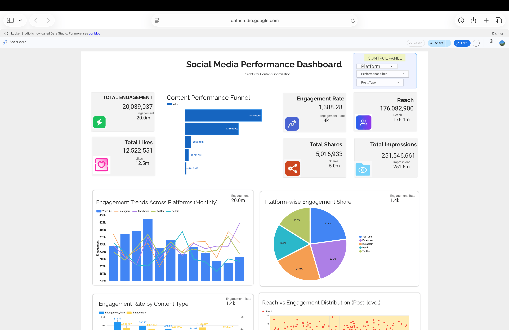

SocialBoard – Social Media Performance Dashboard

LIVE DASHBOARD
[View Dashboard](https://datastudio.google.com/reporting/56c33203-077b-44aa-a329-859133d4a214)

A professional social media analytics dashboard built using Google Looker Studio and Google Sheets, designed to help content creators and digital marketers track engagement, analyze platform performance, and identify high-performing content across multiple social media platforms.
The project focuses on transforming raw social media data into actionable insights through interactive visualizations and KPI-driven analytics.

Project Objective:-

Content creators often struggle to understand:
which platforms perform best,
what type of content drives engagement,
where audience drop-offs occur,
and which posts generate the highest reach and interaction.
This dashboard addresses these challenges by providing a centralized analytics system for monitoring and comparing social media performance metrics.

Features:-

1. KPI Scorecards
Quick overview of:
a.Total Engagement
b.Engagement Rate
c.Reach
d.Total Likes
e.Total Shares
f.Total Impressions

2. Engagement Trends Across Platforms
Tracks monthly engagement performance for:
YouTube
Instagram
Facebook
Twitter/X
Reddit
Helps creators identify seasonal growth patterns and platform consistency.

3. Platform-wise Engagement Share
Visual comparison of contribution percentages from each platform toward total engagement.
Useful for identifying the most impactful platform.

4. Engagement Rate by Content Type
Analyzes performance of different post formats:
Reels
Videos
Stories
Carousels
Images
Helps optimize future content strategy.

5. Reach vs Engagement Distribution
Scatter plot visualization showing the relationship between:
Reach
Engagement
Post-level performance
Useful for identifying viral or underperforming content.

6. Engagement Composition Analysis
Compares:
Likes
Shares
Comments
Across different platforms to understand audience interaction behavior.

7. Top Performing Content Section
Displays the highest-performing posts based on:
Engagement
Engagement Rate
Likes
Shares
Comments
Enables creators to identify successful content patterns.

8. Interactive Control Panel
Dashboard filters allow users to dynamically analyze data based on:
Platform
Post Type
Performance Filters
Date Selection

9. Technologies Used
Tool- Purpose
Google Looker Studio- Dashboard & Visualization
Google Sheets- Data Source Management
GitHub- Project Documentation
Figma- UI/UX Inspiration & Layout Planning

10. Dataset Information
The dataset contains social media performance metrics including:
Post ID
Platform
Reach
Engagement
Likes
Shares
Comments
Impressions
Engagement Rate
Post Type
Date

The data was structured and optimized for interactive dashboard analysis.

🎯 Target Users
This dashboard is designed for:
Content Creators
Social Media Managers
Digital Marketing Teams
Brand Analysts
Marketing Students & Researchers

📸 Dashboard Preview

MAIN DASHBOARD

A. Key Insights Enabled by the Dashboard

Identify the best-performing social media platform
Analyze audience engagement patterns
Compare content format effectiveness
Detect high-reach but low-engagement posts
Track overall audience interaction trends
Discover top-performing content strategies

B. Academic Purpose

This project was developed as part of a university analytics and visualization project with the goal of demonstrating:
data storytelling,
dashboard design,
business intelligence visualization,
and user-centric analytics systems.

👨‍💻 Developed By
https://github.com/adrijatarafder, https://github.com/bhavnasinha080, https://github.com/anunayit

Social Media Analytics Dashboard Project
2026
